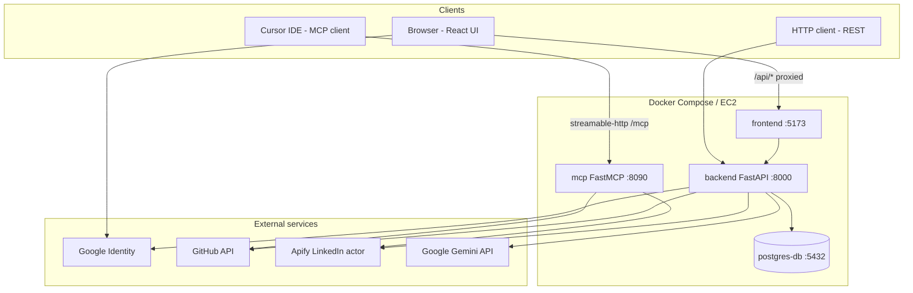
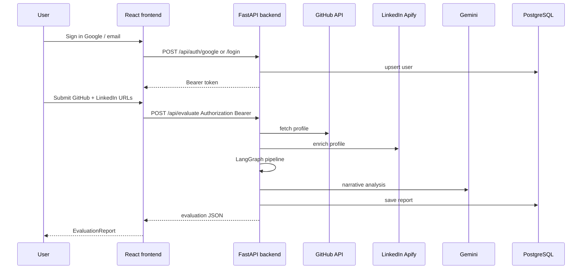
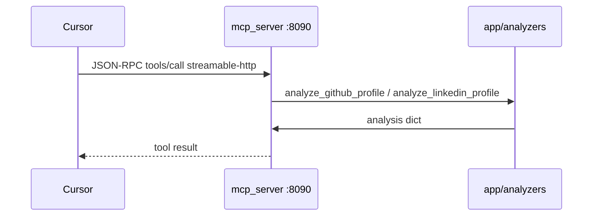
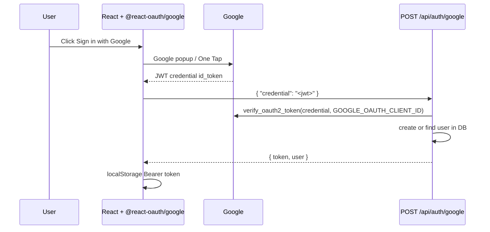

# CareerLens

CareerLens is a developer profile evaluation platform for HR and recruiters. It analyzes public **GitHub** and **LinkedIn** profiles, runs structured scoring and LLM narrative analysis, and produces evaluation reports stored in PostgreSQL.

The system has three ways to use the same profile analyzers:

| Path | Who uses it | Port (default) |
|------|-------------|----------------|
| **Web app** | Recruiters in the browser | UI `5173`, API `8000` |
| **REST APIs** | Integrations / direct API calls | `8000` |
| **MCP server** | Cursor and other MCP clients | `8090` |

---

## Demo video


<video src="docs/demo/demo.mp4" controls width="100%">
  <a href="docs/demo/demo.mp4">Download CareerLens demo (MP4)</a>
</video>

---

## What it does

- Analyze GitHub profiles (repos, languages, 90-day activity signals)
- Enrich LinkedIn profiles (Apify, JSON fallback, manual overrides)
- Full candidate evaluation via LangGraph workflow (features → LLM → scoring)
- Save reports and users in PostgreSQL
- Google Sign-In and email/password auth
- Dockerized local and production deployment
- MCP tools for AI-assisted profile checks in Cursor

---

## Architecture overview



### Web evaluation flow (HR product)



**LangGraph pipeline** (`backend/app/graph/workflow.py`):

```txt
data_fetch → processing → llm_analysis → scoring → output
```

| Node | Responsibility |
|------|----------------|
| `data_fetch` | `analyze_github_profile`, `analyze_linkedin_profile` |
| `processing` | Feature engineering (`feature_pipeline`) |
| `llm_analysis` | Strengths, weaknesses, hiring notes (Gemini) |
| `scoring` | Weighted category scores |
| `output` | Final JSON for UI and DB |

### MCP flow (developer / Cursor)

MCP is **not** used by the web UI. It exposes the same analyzers as standalone tools over the [Model Context Protocol](https://modelcontextprotocol.io/).



| Endpoint | Purpose |
|----------|---------|
| `GET /health` | Liveness, tool list, token flags (browser-friendly) |
| `POST /mcp` | MCP streamable HTTP transport (Cursor only; not a normal browser page) |

**Implementation:** `backend/tools/mcp_server.py` (FastMCP, `streamable-http`).

**Legacy stdio tools** (optional, for older Cursor configs): `backend/tools/githubtool.py`, `backend/tools/linkedintool.py`.

---

## Tech stack

| Layer | Technologies |
|-------|----------------|
| Frontend | React, TypeScript, Vite, TailwindCSS |
| Backend | FastAPI, Python, Pydantic, LangGraph |
| Database | PostgreSQL (Docker); SQLite fallback for local dev without Postgres |
| AI | Google Gemini |
| LinkedIn | Apify (primary), JSON / placeholder fallbacks |
| GitHub | REST API (`GITHUB_TOKEN` recommended) |
| MCP | `mcp` Python SDK, FastMCP |
| Ops | Docker, Docker Compose, EC2 |

---

## Project structure

```txt
EVALUATION-/
├── frontend/                 # React UI (Vite dev server)
│   ├── src/pages/            # EvaluatePage, AuthPage, …
│   └── .env                  # VITE_GOOGLE_CLIENT_ID (local)
├── backend/
│   ├── app/
│   │   ├── analyzers/        # Shared GitHub + LinkedIn logic
│   │   ├── graph/            # LangGraph workflow + state
│   │   ├── routes/           # evaluate, auth, profile, analyze
│   │   ├── analysis/         # LLM reasoner
│   │   ├── scoring/
│   │   └── collectors/
│   ├── tools/
│   │   ├── mcp_server.py     # HTTP MCP (port 8090)
│   │   ├── githubtool.py     # stdio MCP (legacy)
│   │   └── linkedintool.py
│   └── .env                  # secrets (never commit)
├── docker-compose.yml        # frontend, backend, mcp, postgres-db
├── .cursor/mcp.json          # Cursor MCP URL (local or remote)
└── start_mcp.ps1             # Run MCP locally without Docker
```

---

## Authentication

### Google OAuth (primary for production UI)

Uses **Google Identity Services** (Sign in with Google button) — ID token flow, not a server-side redirect OAuth loop.



**Configuration (must match):**

| Variable | Where |
|----------|--------|
| `VITE_GOOGLE_CLIENT_ID` | `frontend/.env` (baked at Vite dev start) |
| `GOOGLE_OAUTH_CLIENT_ID` | `backend/.env` (same Web client ID) |

**Google Cloud Console** → Credentials → **Web application** client → **Authorized JavaScript origins**:

- `http://localhost:5173`
- `http://127.0.0.1:5173` (only if you open the app with that host)
- Production: a **hostname with a public TLD** (e.g. `https://app.yourdomain.com`)

> **Important:** Google does **not** allow raw public IPs (e.g. `http://13.x.x.x:5173`) as JavaScript origins. For EC2 without a domain, use a hostname such as `http://13-200-229-164.nip.io:5173` or attach a real domain with HTTPS.

**OAuth consent screen:** If the app is in **Testing**, add test user emails under **Audience → Test users**.

### Email / password

- `POST /api/auth/register`
- `POST /api/auth/login`

Returns the same signed session `token` used as `Authorization: Bearer <token>` on protected routes.

---

## MCP setup

### Local (Docker Compose)

```bash
docker compose up --build
```

| Service | URL |
|---------|-----|
| MCP | http://127.0.0.1:8090/mcp |
| Health | http://127.0.0.1:8090/health |

### Local (Python only)

```powershell
.\start_mcp.ps1
```

Loads `backend/.env` and runs `python tools/mcp_server.py`.

### Cursor configuration

Project file `.cursor/mcp.json`:

```json
{
  "mcpServers": {
    "careerlens": {
      "url": "http://127.0.0.1:8090/mcp"
    }
  }
}
```

For MCP on a remote server (EC2), use the server URL or an SSH tunnel:

```bash
ssh -L 8090:127.0.0.1:8090 ec2-user@<EC2_PUBLIC_IP>
```

Then keep Cursor on `http://127.0.0.1:8090/mcp`.

**Security:** MCP has no built-in auth. Do not expose port `8090` to `0.0.0.0/0` without IP restriction or a tunnel.

### MCP tools

| Tool | Description |
|------|-------------|
| `analyze_github_profile` | Public GitHub URL → signals and highlights |
| `analyze_linkedin_profile` | LinkedIn URL; optional `experience_years`, `achievements`, `skills` |

Same implementation as `backend/app/analyzers/` used by `/api/analyze/*` and the evaluate workflow.

---

## Environment variables

Copy `backend/.env.example` → `backend/.env`.

| Variable | Used by |
|----------|---------|
| `DATABASE_URL` | Backend (Postgres in Docker) |
| `AUTH_SECRET` | Signing session tokens |
| `GOOGLE_OAUTH_CLIENT_ID` | Google token verification |
| `GEMINI_API_KEY` | Evaluation LLM |
| `APIFY_API_TOKEN` | LinkedIn enrichment |
| `GITHUB_TOKEN` | GitHub rate limits / private metadata |
| `CORS_ORIGINS` | Comma-separated browser origins for API |

Frontend (`frontend/.env`):

| Variable | Purpose |
|----------|---------|
| `VITE_GOOGLE_CLIENT_ID` | Google Sign-In button |
| `VITE_PROXY_TARGET` | Set by Docker Compose to `http://backend:8000` |

> Local dev: leave `VITE_API_BASE_URL` unset so the browser calls `/api` through the Vite proxy (avoids CORS issues).

---

## Running locally

```bash
git clone <repo-url>
cd EVALUATION-

# backend/.env and frontend/.env configured
docker compose up --build
```

| Service | URL |
|---------|-----|
| Frontend | http://localhost:5173 |
| Backend | http://localhost:8000/status |
| MCP health | http://localhost:8090/health |

Alternative without Docker:

```powershell
.\start_backend.ps1    # repo root
cd frontend; npm run dev
.\start_mcp.ps1        # optional MCP
```

---

## Deploying to EC2 (Docker Hub)

Typical production layout on the instance (`~/app/`):

```yaml
services:
  backend:
    image: suryakanneti/evaluation-backend:latest
    ports: ["8000:8000"]
    env_file: [.env]
    environment:
      DATABASE_URL: postgresql://postgres:password@db:5432/evaluation
      CORS_ORIGINS: "http://localhost:5173,https://your-domain.com"

  frontend:
    image: suryakanneti/evaluation-frontend:latest
    ports: ["5173:5173"]
    environment:
      VITE_GOOGLE_CLIENT_ID: <same-as-local-web-client-id>

  mcp:
    image: suryakanneti/evaluation-backend:latest
    ports: ["8090:8090"]
    env_file: [.env]
    environment:
      MCP_HOST: "0.0.0.0"
      MCP_PORT: "8090"
      MCP_TRANSPORT: streamable-http
    command: ["python", "tools/mcp_server.py"]

  db:
    image: postgres:16
    volumes: [postgres_data:/var/lib/postgresql/data]
```

### CI/CD (GitHub Actions)

Every push to **`main`** runs [`.github/workflows/deploy.yml`](.github/workflows/deploy.yml):

1. Build and push `suryakanneti/evaluation-backend` and `suryakanneti/evaluation-frontend` to Docker Hub (`:latest` and `:sha-<commit>`).
2. SSH into EC2, `cd ~/app`, `docker-compose pull` for `backend`, `frontend`, and `mcp`, then `docker-compose up -d` (EC2 uses the `docker-compose` v1 command).

CI does **not** change `~/app/docker-compose.yml` or `~/app/.env` on the instance.

#### GitHub repository secrets

Configure under **Settings → Secrets and variables → Actions**:

| Secret | Description |
|--------|-------------|
| `DOCKERHUB_USERNAME` | Docker Hub username (e.g. `suryakanneti`) |
| `DOCKERHUB_TOKEN` | Docker Hub access token (Account → Security) |
| `EC2_HOST` | EC2 public IP or Elastic IP |
| `EC2_USER` | SSH user (e.g. `ec2-user`) |
| `EC2_SSH_PRIVATE_KEY` | Full `.pem` private key contents |

#### EC2 prerequisites for CI

- `~/app/docker-compose.yml` references `suryakanneti/evaluation-backend:latest` and `evaluation-frontend:latest` (and `mcp` if used).
- `~/app/.env` exists with production secrets (never committed to Git).
- Security group allows SSH (port 22) from GitHub Actions runners, **or** use a self-hosted runner on EC2 if inbound SSH from GitHub IPs is not possible.
- If Docker Hub images are **private**, run `docker login` once on the EC2 instance.
- Prefer an **Elastic IP** so `EC2_HOST` does not change after instance stop/start.

#### Manual deploy (alternative)

```powershell
cd backend
docker build -t suryakanneti/evaluation-backend:latest .
docker push suryakanneti/evaluation-backend:latest
```

```bash
cd ~/app
docker-compose pull backend frontend mcp
docker-compose up -d
curl -s http://127.0.0.1:8090/health
```

#### Rollback

Pin `~/app/docker-compose.yml` to `evaluation-backend:sha-<old-commit>` (or retag on Hub), then `docker-compose pull && docker-compose up -d backend mcp`.

### EC2 checklist

| Item | Notes |
|------|--------|
| Security group | `5173` (UI), `8000` (API), `22` (SSH); `8090` only if needed for MCP |
| Elastic IP | Stops public IP from changing on instance stop/start |
| `.env` on server | Same secrets as local `backend/.env` |
| Google OAuth | Hostname with TLD in JavaScript origins + matching `CORS_ORIGINS` |
| After reboot | `cd ~/app && docker-compose up -d` |

### What to share

| Audience | Share |
|----------|--------|
| HR / recruiters | `https://your-domain.com` or nip.io hostname on port 5173 |
| Developers (MCP) | SSH tunnel or restricted `8090` + Cursor `mcp.json` |
| Never share publicly | `.env`, SSH keys, `AUTH_SECRET`, API tokens |

---

## API endpoints

| Method | Path | Auth | Description |
|--------|------|------|-------------|
| GET | `/status` | No | Health and config flags |
| POST | `/api/auth/google` | No | Google Sign-In |
| POST | `/api/auth/login` | No | Email login |
| POST | `/api/auth/register` | No | Email register |
| POST | `/api/evaluate` | Bearer | Full evaluation pipeline |
| GET | `/api/reports` | Bearer | List saved reports |
| POST | `/api/analyze/github` | Optional | GitHub analyzer only |
| POST | `/api/analyze/linkedin` | Optional | LinkedIn analyzer only |

### Example: analyze GitHub

```http
POST /api/analyze/github
Content-Type: application/json

{
  "github_url": "https://github.com/username"
}
```

### Example: full evaluate

```http
POST /api/evaluate
Authorization: Bearer <token>
Content-Type: application/json

{
  "github_url": "https://github.com/username",
  "linkedin_url": "https://www.linkedin.com/in/username",
  "target_role": "Software Engineer",
  "is_intern": false
}
```

---

## Database

PostgreSQL in Docker (`postgres-db` service, database `careerlens` locally or `evaluation` on some EC2 setups).

```bash
docker exec -it <postgres-container> psql -U postgres -d careerlens
```

```sql
\dt
SELECT id, email, name FROM users LIMIT 10;
```

---

## Troubleshooting

| Symptom | Likely cause |
|---------|----------------|
| Google "Access blocked" on EC2 | IP not allowed; use domain or `*.nip.io` origin |
| Google works locally, not EC2 | Missing `VITE_GOOGLE_CLIENT_ID` in frontend container |
| CORS errors | `CORS_ORIGINS` missing exact browser origin |
| LinkedIn placeholder on EC2 | `APIFY_API_TOKEN` missing in container `env_file` |
| MCP browser shows `text/event-stream` error | Normal — use `/health` in browser, `/mcp` in Cursor only |
| `docker compose` not found on EC2 | Use `docker-compose` (hyphen); CI deploy script uses that |
| Old MCP code on EC2 | Rebuild and `docker push` backend image, then `docker-compose pull` |

---

## License

MIT
